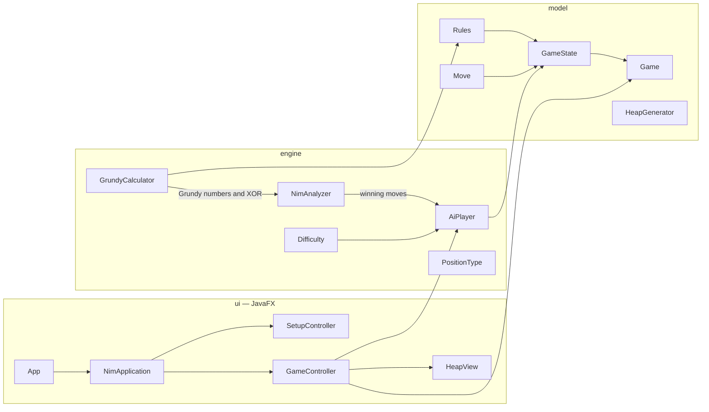

<div align="center">

# NIM — a Grundy-number AI opponent

**A JavaFX implementation of the game of Nim whose computer opponent plays perfectly using the Sprague–Grundy theorem.**

[](https://openjdk.org/projects/jdk/21/)
[](https://openjfx.io/)
[](https://maven.apache.org/)
[](https://junit.org/junit5/)
[](LICENSE)

*Pick your heaps, pick your rules, and try to beat an opponent that never loses a won position.*

<sub>An optional (extra-credit) assignment for the <b>Algorithmic Game Theory</b> course<br>
Computer Engineering BSc · Faculty of Electrical Engineering and Informatics (VIK) · Budapest University of Technology and Economics (BME)</sub>

</div>

---

## Table of contents

- [Overview](#overview)
- [Features](#features)
- [The mathematics](#the-mathematics)
  - [Combinatorial games and position types](#combinatorial-games-and-position-types)
  - [Grundy numbering](#grundy-numbering)
  - [Grundy numbers of a single heap](#grundy-numbers-of-a-single-heap)
  - [The Sprague–Grundy theorem: combining heaps with XOR](#the-spraguegrundy-theorem-combining-heaps-with-xor)
  - [The winning move](#the-winning-move)
  - [Why the raw heap sizes must not be XOR-ed](#why-the-raw-heap-sizes-must-not-be-xor-ed)
  - [A worked example](#a-worked-example)
- [How the AI plays](#how-the-ai-plays)
- [Getting started](#getting-started)
- [Usage](#usage)
- [Architecture](#architecture)
- [Testing](#testing)
- [Project structure](#project-structure)
- [Roadmap](#roadmap)
- [Contributing](#contributing)
- [License](#license)
- [Acknowledgements](#acknowledgements)

---

## Overview

**Nim** is played with several heaps of stones. Two players alternate; on each turn the current player removes
one or more stones from a *single* heap. In the **normal play** convention used here, **the player who takes the
last stone wins.**

This project is a desktop game (Java 21 + JavaFX) with a computer opponent that does not guess, search, or learn:
it computes the **Grundy number** of the current position and, whenever a winning move exists, plays one.
A built-in **tutor mode** shows the Grundy numbers in binary, their XOR, and the type of every position, so the
program doubles as an interactive illustration of the Sprague–Grundy theory.

> **About this project.** It was written as an optional, extra-credit assignment (Hungarian: *szorgalmi feladat*)
> for the **Algorithmic Game Theory** course of the Computer Engineering BSc programme at the Faculty of Electrical
> Engineering and Informatics (VIK) of the **Budapest University of Technology and Economics (BME)**. The Grundy
> numbering definition it implements is taken from the course material.
>
> The user interface is in **Hungarian**; the source code identifiers, this document, and the mathematics are
> language-independent.

## Features

| | |
|---|---|
| **Flexible setup** | 1–20 heaps, 0–50 stones each; set sizes individually or randomise them within a range |
| **Three rule sets** | classic Nim (take any number, the default), the *1-2-3* variant, or a custom upper limit *1..k* |
| **Perfect-play AI** | based on Grundy numbers, correct for every rule set — no heuristics, no machine learning |
| **Three difficulty levels** | *Easy* occasionally blunders from a won position; *Medium* plays perfectly and moves randomly when lost; *Hard* plays perfectly and stalls when lost, waiting for your mistake |
| **Tutor mode** | per-heap size and Grundy number in fixed-width binary, the XOR, the position type $T(v)$, a plain-language explanation and a *Hint* button that marks a winning move |
| **AI vs. AI showcase** | let two engines of chosen strengths play each other, with pause / resume / single-step controls |
| **Quality of life** | stone-by-stone preview of a move on hover, ghost outlines of the stones just removed, move log, undo (including the AI's reply), rematch, live $T(J)$ read-out on the setup screen |
| **BME look** | burgundy-and-white theme in the colours of the Budapest University of Technology and Economics; every JavaFX control is restyled in `style.css`, the BME logo sits in the header and the favicon is the window icon |
| **Console demo** | `--console` flag prints a full self-play game with all Grundy values, for scripts and reports |

## The mathematics

### Combinatorial games and position types

A (finite, impartial) combinatorial game is a directed acyclic graph $(V, E)$: the vertices are **positions**, and
an edge $pq \in E$ means that a legal move takes position $p$ to position $q$. Positions with no outgoing edges
are **terminal**; under normal play the player who must move from a terminal position has lost.

Every position $v$ has a **type**:

- $T(v) = \mathrm{I}$ — the player **about to move** from $v$ (the "first" player at $v$) has a winning strategy;
- $T(v) = \mathrm{II}$ — the **other** ("second") player has a winning strategy.

The type of the initial position is the **type of the game**, $T(J)$. Because the game graph is finite and
acyclic, every position has exactly one of these two types.

### Grundy numbering

> **Definition.** For a combinatorial game $(V,E)$ a function $g : V \to \mathbb{N}_0$ is a **Grundy numbering** if
> for every $p \in V$
>
> $$g(p) = \min \lbrace n \in \mathbb{N}_0 : n \neq g(q) \ \forall \ pq \in E \rbrace .$$
>
> Abbreviated: $g(p) = \mathrm{mex}\lbrace g(q) : pq \in E \rbrace$, where **mex** (*minimal excludant*) is the
> smallest non-negative integer **not** in the set. The **Grundy number of the game** $(V, E, p_0)$ is $g(p_0)$.

Two facts follow directly from the definition:

1. Every terminal position has $g = \mathrm{mex}\emptyset = 0$.
2. If $g(p) = 0$, no move leads to a position with $g = 0$ (otherwise $0$ would not be excluded);
   if $g(p) > 0$, some move leads to a position with $g = 0$ (otherwise $0$ would be the mex).

Hence the type of a position is read off its Grundy number:

$$
T(v) = \mathrm{II} \iff g(v) = 0, \qquad T(v) = \mathrm{I} \iff g(v) > 0 .
$$

A player with a winning strategy simply **always moves to a position with Grundy number 0** (the *kernel*).
The opponent is then forced to a non-zero position, from which a move back to zero is guaranteed to exist,
and the sequence ends at the terminal position (which is $0$) with the opponent to move — i.e. the opponent
loses.

### Grundy numbers of a single heap

For one heap of $n$ stones the moves are $n \to n - r$ for every permitted removal $r$. The program computes
$g(n)$ **literally from the definition**, iteratively and with memoisation:

$$
g(0) = 0, \qquad g(n) = \mathrm{mex}\lbrace g(n-r) : 1 \le r \le \min(n, k) \rbrace,
$$

where $k$ is the maximum removal allowed by the rule set ($k = \infty$ for classic Nim). Two special cases are
well known, and the unit tests verify that the generic mex computation reproduces them:

| Rule set | Grundy number of a heap of $n$ | Why |
|---|---|---|
| classic Nim (any number) | $g(n) = n$ | from $n$ every $0 \le m < n$ is reachable, so the mex of $\lbrace 0,\dots,n-1 \rbrace$ is $n$ |
| take $1..k$ | $g(n) = n \bmod (k+1)$ | the reachable values are the previous $k$ residues; the missing one is $n \bmod (k+1)$ |
| take $1, 2, 3$ | $g(n) = n \bmod 4$ | the case $k = 3$ |

The single-heap 1-2-3 game therefore has $T(J) = \mathrm{I}$ exactly when $n$ is **not divisible by 4**: the first
player can always make the heap a multiple of 4, and any move from a multiple of 4 destroys that property.

### The Sprague–Grundy theorem: combining heaps with XOR

A Nim position with heaps $n_1, \dots, n_m$ is the **disjunctive sum** of $m$ single-heap games: a move is made in
exactly one component. The Sprague–Grundy theorem states that the Grundy number of a sum is the **bitwise
exclusive or** (XOR, written $\oplus$) of the components' Grundy numbers:

$$
g(n_1, n_2, \dots, n_m) \;=\; g(n_1) \oplus g(n_2) \oplus \cdots \oplus g(n_m).
$$

Writing $X$ for this value (the *Nim-sum*), the position is of type $\mathrm{II}$ — lost for the player to move —
precisely when $X = 0$.

*Sketch of proof.* Let $X = \bigoplus_i g(n_i)$. One shows (a) no move keeps the XOR at $X$: changing a single
component's Grundy number from $a$ to $a' \neq a$ changes the XOR from $X$ to $X \oplus a \oplus a' \neq X$; and
(b) for every $y < X$ some move reaches a position whose XOR is $y$: look at the highest bit of $X \oplus y$,
choose a component $i$ whose $g(n_i)$ has that bit set, and move it to the value $g(n_i) \oplus X \oplus y$,
which is smaller than $g(n_i)$ and therefore reachable (single-heap Grundy values below $g(n_i)$ are all
reachable by the definition of mex). Together (a) and (b) say exactly that $X$ is the mex of the reachable XORs.

### The winning move

From a position with $X \neq 0$ the winning player must move to $X' = 0$. In component $i$ the other components
contribute $X \oplus g(n_i)$, so heap $i$ must be brought to a size $n_i'$ with

$$
g(n_i') = X \oplus g(n_i).
$$

- **Classic Nim** ($g(n) = n$): reduce heap $i$ to $n_i \oplus X$; this is possible for any heap where
  $n_i \oplus X < n_i$, i.e. where $n_i$ has a 1 in the highest set bit of $X$.
- **Limited removal** ($g(n) = n \bmod (k+1)$): remove $r = (g(n_i) - (X \oplus g(n_i))) \bmod (k+1)$
  stones, provided $1 \le r \le n_i$.

Rather than hard-coding these formulas, the engine simply scans every heap and every legal removal and keeps
the moves whose resulting XOR is 0 — the theorem guarantees at least one exists, and the scan is correct for any
rule set (`NimAnalyzer.winningMoves`).

### Why the raw heap sizes must not be XOR-ed

For classic Nim the Grundy number equals the heap size, so XOR-ing the sizes is correct. For the 1-2-3 variant
it is **not**: with heaps $\lbrace 4, 8 \rbrace$ the raw XOR is $4 \oplus 8 = 12 \neq 0$, which would wrongly suggest a winning
move, whereas the Grundy numbers are $4 \bmod 4 = 0$ and $8 \bmod 4 = 0$, giving $X = 0$ — a lost position for the
player to move. The AI always XORs Grundy numbers, never sizes; the tutor panel shows both columns so the
difference is visible.

### A worked example

Classic Nim, heaps $\lbrace 3, 4, 5 \rbrace$, three-bit binary:

```
heap   size   g(size)
 1      011     011
 2      100     100
 3      101     101
              ─────
       XOR =   010   = 2   →   T(v₀) = I  (the player to move wins)
```

The winning move must make the XOR zero: $X = 2$, and the only heap with $n_i \oplus 2 < n_i$ is heap 1
($3 \oplus 2 = 1$). Remove **two stones from heap 1**, leaving $\lbrace 1, 4, 5 \rbrace$ with $1 \oplus 4 \oplus 5 = 0$.
Afterwards the opponent can only reach non-zero positions, and the winner keeps answering with a move back to
zero — for example the mirror positions $\lbrace 0,4,4 \rbrace \to \lbrace 0,3,3 \rbrace \to \lbrace 0,2,2 \rbrace \to \lbrace 0,1,1 \rbrace \to \lbrace 0,0,0 \rbrace$.

## How the AI plays

```
X ← XOR of the heaps' Grundy numbers
if X ≠ 0:                                  # T(v) = I — a winning move exists
    play any move whose resulting XOR is 0   (Easy: with 40 % probability play a random move instead)
else:                                      # T(v) = II — every move loses against perfect play
    Medium → play a random legal move
    Hard   → take one stone from the largest heap (stall and wait for a mistake)
```

Everything is deterministic and cheap: computing $g$ for a heap of $n$ stones is $O(n \cdot k)$ once (memoised),
and choosing a move is $O(\mathrm{heaps} \times k)$.

## Getting started

### Prerequisites

- **JDK 21** or newer ([Eclipse Temurin](https://adoptium.net/), [Oracle](https://www.oracle.com/java/), …)
- **Apache Maven 3.9+**

JavaFX is pulled in as a regular Maven dependency (`org.openjfx:javafx-controls`, `javafx-fxml`), so no separate
SDK installation is required.

### Build & run

```bash
git clone https://github.com/<your-account>/nim.git
cd nim
mvn clean javafx:run
```

### Run the tests

```bash
mvn test
```

### Generate the API documentation

Every class and public member carries Javadoc (in Hungarian, matching the UI), and the build is configured
with `-Xdoclint:all`, so the documentation can be generated without warnings:

```bash
mvn javadoc:javadoc        # → target/site/apidocs/index.html
```

## Usage

### Graphical application

1. **Setup screen** — choose the number of heaps and their sizes (or click *Random sizes* / *Everything random*),
   the rule set, the AI difficulty, who starts, and whether tutor mode is on. The bottom line shows the Grundy
   number of the initial position and $T(J)$ live, so you know before the first move whether the starter can force
   a win.
2. **Game screen** — click a heap, then the button with the number of stones to remove (a spinner appears for
   large limits). Hovering a button highlights the stones that would go; the previous move's stones remain as
   dashed outlines. The AI answers after a short delay.
3. **Tutor panel** — heap sizes and Grundy numbers in binary (fixed width, aligned to the largest initial heap),
   the XOR, $T(v_i)$ in green/red, and a hint button.
4. **AI vs. AI** — tick the unobtrusive checkbox at the bottom of the setup screen, pick a strength for the
   second engine, and watch. Use *Pause* / *Resume* and *Single step* to follow the game move by move.

### Console demo

```bash
mvn -q compile
java -cp target/classes hu.bme.nim.App --console 0 3 4 5   # 0 = unlimited (classic Nim), heaps 3 4 5
java -cp target/classes hu.bme.nim.App --console 3 8 5 1   # take 1..3, heaps 8 5 1
```

<details>
<summary>Sample output (<code>--console 3 8 5 1</code>)</summary>

```
Szabály: 1–3 kavics
Kezdőállás v0 = [8, 5, 1]  →  a játék típusa T(J) = II

  v0  [8, 5, 1]   kupacok: 1000, 0101, 0001   Grundy: 0000, 0001, 0001   XOR = 0000 (0)   T(v0) = II
Játékos lép: 1 kavics a(z) 1. kupacból
  v1  [7, 5, 1]   kupacok: 0111, 0101, 0001   Grundy: 0011, 0001, 0001   XOR = 0011 (3)   T(v1) = I
Gép lép: 3 kavics a(z) 1. kupacból
  v2  [4, 5, 1]   kupacok: 0100, 0101, 0001   Grundy: 0000, 0001, 0001   XOR = 0000 (0)   T(v2) = II
  ...
Győztes: Gép
```

The starting position is of type II, so the first player is lost; the second engine restores $X = 0$ after every
move and wins — exactly as the theory predicts. (On a Windows console run `chcp 65001` first for the accented
characters.)

</details>

## Architecture

The game logic is completely independent of the user interface and is covered by unit tests; JavaFX only
renders `GameState`s and forwards user input.



| Layer | Class | Responsibility |
|---|---|---|
| `model` | `Rules` | maximum removal per move (`UNLIMITED` = classic Nim) |
| | `Move`, `Player` | a move (heap index, count); the two seats |
| | `GameState` | **immutable** position: heaps, player to move, rules; `legalMoves()`, `apply(move)`, `winner()` |
| | `Game` | a mutable match: current state, move history, `undo()`, `rematch()` |
| | `HeapGenerator` | random initial heaps |
| `engine` | `GrundyCalculator` | $g(n)$ by mex with memoisation; $g$ of a position by XOR; `type(state)`; binary formatting helpers |
| | `PositionType` | the enum $\lbrace \mathrm{I}, \mathrm{II} \rbrace$ |
| | `NimAnalyzer` | all moves that lead to a Grundy-0 position |
| | `AiPlayer`, `Difficulty` | move selection per difficulty level |
| `ui` | `NimApplication` | single stage, swaps the setup and game views |
| | `SetupController` + `setup.fxml` | the setup screen |
| | `GameController` + `game.fxml` | the game screen, AI scheduling, tutor panel, log, AI-vs-AI controls |
| | `HeapView` | one heap drawn as stones (JavaFX shapes) |
| | `GameSettings` | the settings record passed from setup to game |

`App` is a plain launcher (not an `Application` subclass) so the program can be started from the classpath and
can switch to the console demo with `--console`.

## Testing

JUnit 5 tests cover the mathematics and the AI:

- $g(n) = n \bmod 4$ for the 1-2-3 rules, $g(n) = n \bmod (k+1)$ for several $k$, $g(n) = n$ for classic Nim;
  memoisation is order-independent.
- Multi-heap Grundy numbers equal the XOR of the components; $\lbrace 4, 8 \rbrace$ is of type II under 1-2-3 rules.
- For all three-heap positions up to size 9 and several rule sets: from a type-II position no move reaches
  type II, from a type-I position some move does; `winningMoves` returns exactly the moves that reach Grundy 0.
- *Medium* and *Hard* always move to Grundy 0 from a won position; every level always returns a legal move;
  *Hard* stalls with one stone from the largest heap; *Easy* does blunder sometimes.
- Two perfect engines: the starter wins **iff** the initial position is of type I.
- `GameState`, `Game` (history, undo, rematch) and `HeapGenerator` behaviour.

```bash
mvn test
```

## Project structure

```
nim/
├── pom.xml
├── README.md
├── LICENSE
└── src/
    ├── main/
    │   ├── java/hu/bme/nim/
    │   │   ├── App.java                 # launcher (--console → ConsoleDemo)
    │   │   ├── ConsoleDemo.java
    │   │   ├── model/    Rules, Move, Player, GameState, Game, HeapGenerator
    │   │   ├── engine/   GrundyCalculator, PositionType, NimAnalyzer, AiPlayer, Difficulty
    │   │   └── ui/       NimApplication, SetupController, GameController, HeapView, GameSettings, Theme
    │   └── resources/hu/bme/nim/ui/
    │       ├── setup.fxml
    │       ├── game.fxml
    │       ├── style.css                # BME burgundy theme, all controls restyled
    │       └── images/                  # bme_logo_colored.png, favicon.jfif
    └── test/java/hu/bme/nim/
        ├── engine/   GrundyCalculatorTest, NimAnalyzerAndAiTest
        └── model/    GameStateTest
```

## Roadmap

- [ ] Native installers with `jpackage` (Windows `.msi`, macOS `.dmg`, Linux `.deb`)
- [ ] Misère variant (the player who takes the last stone **loses**)
- [ ] Move animations and optional sound
- [ ] English UI language option

## Contributing

Issues and pull requests are welcome. Please keep the `model` and `engine` layers free of JavaFX dependencies
and add a unit test for any change to the game logic. Run `mvn test` before submitting.

## License

This project is released under the [MIT License](LICENSE).

## Acknowledgements

- This project is an optional assignment for the *Algorithmic Game Theory* course (Computer Engineering BSc,
  BME VIK). The Grundy numbering definition (Definition 1.19) follows the course's lecture notes; the BME logo
  and colours are used with reference to the university.
- R. P. Sprague (1935) and P. M. Grundy (1939) independently discovered the theorem that bears their names;
  C. L. Bouton (1901) gave the first complete analysis of Nim.
